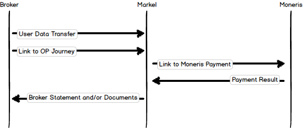

# Broker Integration

## User Flow

## Systems Integration

## Terminology

<dl>
  <dt>Pre-shared key</dt>
  <dd>This is a key that is used to validate the authenicity of the request and should be treated as a private secret that only Markel and the broker have visibility of.</dd>
</dl>

## Security

All data is to be transferred securely using HTTPS/TLS encryption between the broker and Markel's systems. Authenticating the data will be achieved using HMAC signing with a 32 character pre-shared key (PSK).

## Quote Journey

Method: GET

<pre><code>
https://${url_base}?sig=${signature}&ts=${epoch}&al0=${address_line1}&al1=${address_line2}&al2=${address_line3}&al3=${address_line4}&al4=${address_line5}&ci=${city}&cr=${customer_reference}&em=${insured_email}&ex=${expiry_date}&in=${insured_name}&pc=${postal_code}&pn=${policy_number}&pr=${province}

// Signature

base64(sha256hmac(${psk}, "ts=${epoch}al0=${address_line1}al1=${address_line2}al2=${address_line3}al3=${address_line4}al4=${address_line5}ci=${city}cr=${customer_reference}em=${insured_email}ex=${expiry_date}in=${insured_name}pc=${postal_code}pn=${policy_number}pr=${province}"))
</code></pre>

All field keys are required in the signature but not required in the URL. Any fields not specified in the URL must default to an empty string as the value in the signature.

Given the following inputs:

<table>
  <thead>
    <tr>
      <th>Field</th>
      <th>Value</th>
    </tr>
  </thead>
  <tbody>
    <tr><td>psk</td><td>ABCDEFGHIJKLMNOPQRSTUVWXYZ123456</td></tr>
    <tr><td>insured_name</td><td>Nathan Fisher</td></tr>
    <tr><td>expiry</td><td>2017-01-1</td></tr>
    <tr><td>customer_reference</td><td>1234</td></tr>
    <tr><td>policy_number</td><td>3456</td></tr>
    <tr><td>epoch</td><td>1463138046</td></tr>
  </tbody>
<table>

The signature would be generated as follows:

<pre><code>
input = "ts=1463138046al0=al1=al2=al3=al4=ci=cr=1234em=ex=2017-01-01in=Nathan Fisherpc=pn=3456pr="
rawSig = sha256hmac("ABCDEFGHIJKLMNOPQRSTUVWXYZ123456", input)
encSig = base64(rawSig)
</code></pre>

<table>
  <thead>
    <tr>
      <th>Field</th>
      <th>Description</th>
    </tr>
  </thead>
  <tbody>
    <tr><td>epoch</td><td>unix timestamp representing the time the URL was generated.</td></tr>
    <tr><td>insured_name</td><td>the insureds full name.</td></tr>
    <tr><td>insured_email</td><td>the insureds e-mail address.</td></tr>
    <tr><td>policy_number</td><td>the D&O policy number.</td></tr>
    <tr><td>customer_reference</td><td>the policy number bound by the broker.</td></tr>
    <tr><td>inception_date</td><td>the inception date bound by the broker.</td></tr>
    <tr><td>expiry_date</td><td>the expiry date bound by the broker.</td></tr>
    <tr><td>address_line1</td><td>mailing address line 1.</td></tr>
    <tr><td>address_line2</td><td>mailing address line 2.</td></tr>
    <tr><td>address_line3</td><td>mailing address line 3.</td></tr>
    <tr><td>address_line4</td><td>mailing address line 4.</td></tr>
    <tr><td>address_line5</td><td>mailing address line 5.</td></tr>
    <tr><td>city</td><td>mailing city.</td></tr>
    <tr><td>province</td><td>mailing province.</td></tr>
    <tr><td>postal_code</td><td>mailing postcode.</td></tr>
  </tbody>
</table>

### Asynchronous User Data Transfer

Method: POST

<pre><code>
https://${urlbase}?ts=${epoch}&sig=${signature}&v=1

// Body
{
  “policy”: {
    “number”: ${policy_number},
    “inception”: ${inception_date},
    “expiry”: ${expiry_date},
    “insured": {
      “reference”: ${customer_reference},
      "policy_reference": ${policy_reference},
      “fullname": ${insured_name},
      “email": ${insured_email},
      “mailing_address”: {
        “line”: [${line1}, ${line2}],
        “city”: ${city},
        “province”: ${province},
        “post_code”: ${post_code},
        “country”: ${country},
      }
    }
  }
}

// signature

base64(sha256hmac(${psk}, ${city}+${country}+${customer_reference}+${expiry_date}+${inception_date}+${insured_email}+${insured_name}+${line1}+${line2}+${policy_number}+${policy_reference}+${post_code}+${province}))
</code></pre>
